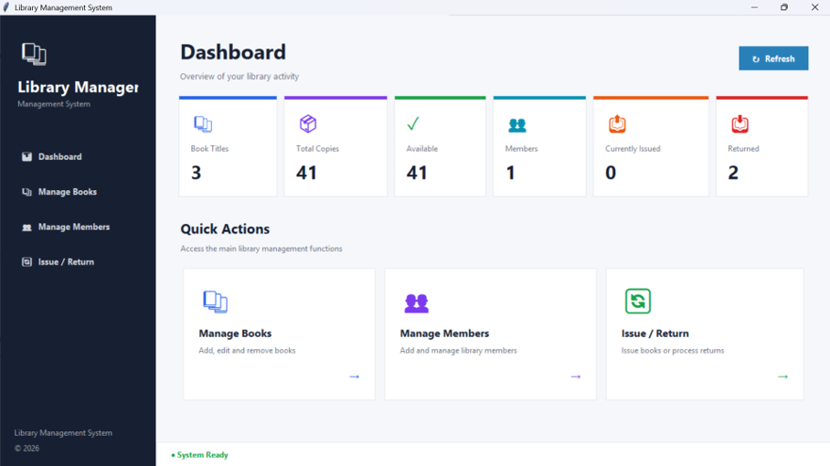
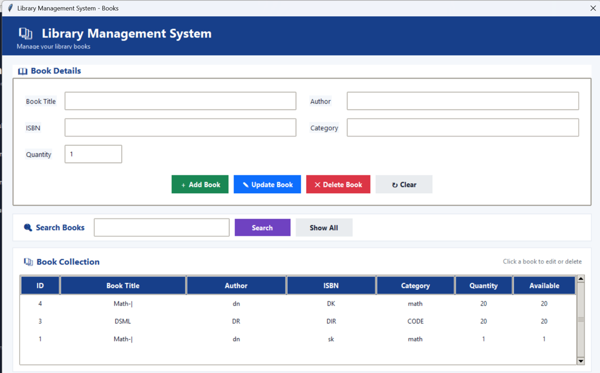

# 📚 Library Management System (LMS)

A **Library Management System (LMS)** developed using **Python** to manage books, students/users, book issue and return records, and other library activities.

This project is designed as an educational project to demonstrate **Python programming, database management, and application development**.

---

## 📌 Project Overview

The **Library Management System** provides a simple digital solution for managing library operations.

It helps manage books, users, book availability, issue records, return records, and other library-related information in an organized way.

---

## ✨ Features

* 📚 Add and manage books
* 🔍 Search books
* 📖 View available books
* 👤 Manage students/users
* 📤 Issue books
* 📥 Return books
* 📊 Manage library records
* 🔐 User/Admin functionality
* 💾 Database management
* 🖼️ Image support
* 🖥️ Simple and user-friendly interface
* 📱 Responsive and easy-to-use interface

---

## 🛠️ Technologies Used

* 🐍 **Python**
* 🌐 **HTML5**
* 🎨 **CSS3**
* ⚡ **JavaScript**
* 🗄️ **SQLite / Database**
* 🎯 **Bootstrap**

---

# 📋 Requirements

Before running this project, make sure the following software is installed:

* Python 3.x
* VS Code / PyCharm
* Web Browser
* Git
* pip

### Python Dependencies

Install the required Python packages using:

```bash
pip install -r requirements.txt
```

---

# 📦 Installation

## 1. Clone the Repository

```bash
git clone https://github.com/AshutoshKumar950/library-management-system-LMS.git
```

## 2. Open the Project Folder

```bash
cd library-management-system-LMS
```

## 3. Create a Virtual Environment

For Windows:

```bash
python -m venv venv
```

## 4. Activate Virtual Environment

### Windows CMD

```bash
venv\Scripts\activate
```

### Windows PowerShell

```bash
venv\Scripts\Activate.ps1
```

## 5. Install Dependencies

```bash
pip install -r requirements.txt
```

---

# ▶️ Run the Project

Run the main Python application:

```bash
python app.py
```

After starting the application, open your browser:

```text
http://127.0.0.1:5000/
```

---

# 📁 Project Structure

```text
library-management-system-LMS/
│
├── README.md
├── requirements.txt
├── app.py
│
├── static/
│   ├── css/
│   ├── js/
│   └── images/
│
├── templates/
│
├── database/
│
├── screenshots/
│   ├── home.png
│   ├── login.png
│   ├── dashboard.png
│   └── books.png
│
└── PPT/
    └── Library_Management_System.pptx
```

---

# 📥 Download PPT — Free

## 🎓 Library Management System PPT

A **free PowerPoint presentation** for the Library Management System project is included in this repository.

### ⬇️ Download PPT

👉 **[📥 Download Library Management System PPT — Free](PPT/Library_Management_System.pptx)**

The PPT can be used for:

* 🎓 College Project Presentation
* 📚 Library Management System Project
* 💻 Python Project Presentation
* 🧑‍🎓 Student Viva
* 📝 Project Demonstration
* 🎤 Seminar / Presentation

> **Note:** The PPT is provided for educational purposes. You can download and customize it according to your project requirements.

---

# 🖼️ Screenshots

## 🏠 Home Page


---

## 🔐 Login Page


---

## 📚 Dashboard



---

## 📖 Book Management



---

# 🖼️ Image Setup

To display screenshots correctly on GitHub, create a folder named:

```text
screenshots
```

Upload your screenshots inside it:

```text
screenshots/
├── home.png
├── login.png
├── dashboard.png
└── books.png
```

The README uses repository-relative paths:

```markdown

```

```markdown

```

```markdown

```

```markdown

```

### ⚠️ Important

Image names must match the actual filenames exactly.

For example:

```text
Home.png
```

and

```text
home.png
```

may be treated as different files.

Use:

```text
screenshots/home.png
```

Do not use:

```text
screenshots\home.png
```

---

# 🗂️ Database

The Library Management System stores and manages library-related information such as:

* 📚 Book details
* 👤 Student/User details
* 📤 Book issue records
* 📥 Book return records
* 📊 Book availability
* 🗃️ Library records

---

# 🔑 Main Library Operations

## 📚 Add Book

The administrator can add new books and maintain book information.

## 🔍 Search Book

Users can search for books available in the library.

## 📤 Issue Book

Available books can be issued to registered students/users.

## 📥 Return Book

Issued books can be returned and the corresponding records can be updated.

## 👤 Manage Users

The system can maintain student/user information for library operations.

## 📊 Manage Records

Library records can be maintained digitally instead of using manual registers.

---

# 🚀 Future Improvements

The project can be enhanced with:

* 📅 Online book reservation
* 📧 Email notifications
* 💰 Automatic fine calculation
* 🔎 Advanced search and filtering
* 👤 Student profile management
* 📊 Advanced admin dashboard
* 📚 Book availability tracking
* 📄 PDF report generation
* ☁️ Cloud database integration
* 📱 Mobile-friendly interface
* 🔳 QR/Barcode-based book management
* 🔔 Automatic due-date reminders

---

# 🔒 Security

For production use:

* Use secure password hashing.
* Do not upload passwords or API keys.
* Do not upload `.env` files containing sensitive information.
* Keep database credentials private.
* Use environment variables for sensitive configuration.
* Do not upload unnecessary files such as virtual environments or cache files.

---

# 📌 GitHub Repository

**Library Management System — LMS**

👉 **[View Repository](https://github.com/AshutoshKumar950/library-management-system-LMS)**

---

# 👨‍💻 Developer

**Ashutosh Kumar**

Computer Science Engineering Student

### GitHub

👉 **[AshutoshKumar950](https://github.com/AshutoshKumar950)**

---

# 📄 License

This project is created for **educational and learning purposes**.

---

# ⭐ Support

If you find this project useful, please consider giving the repository a ⭐ **Star** on GitHub.

You can also fork the repository and improve the project according to your requirements.

---

# 📚 Library Management System

### **Learn • Practice • Build • Grow**

---

## 🎓 Free Educational Resource

**Library Management System Project + PPT**

📚 Learn Python
💻 Practice Development
🎓 Prepare Your College Project
🚀 Build Your Skills
