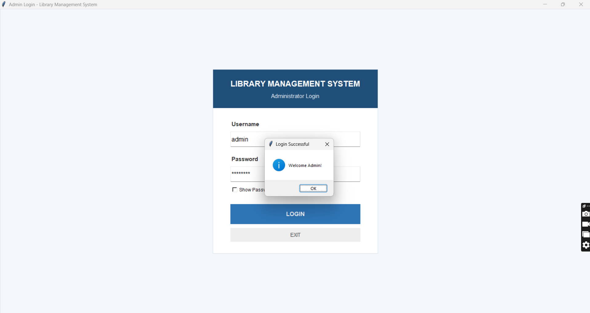
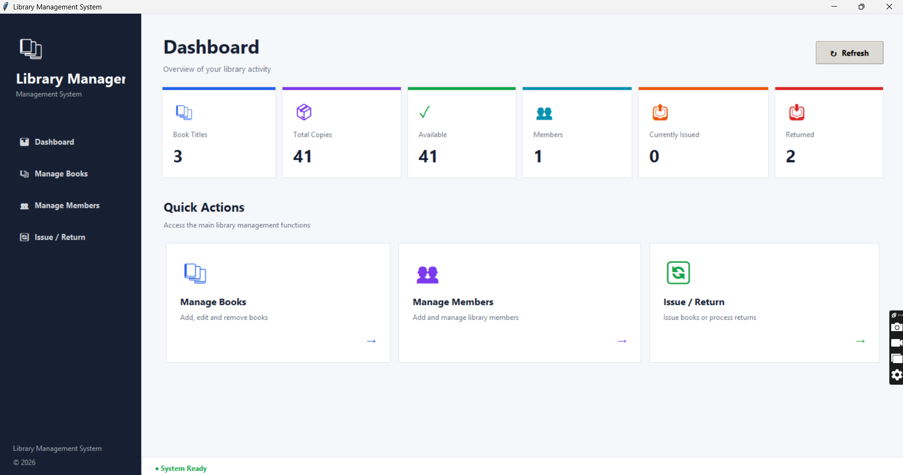
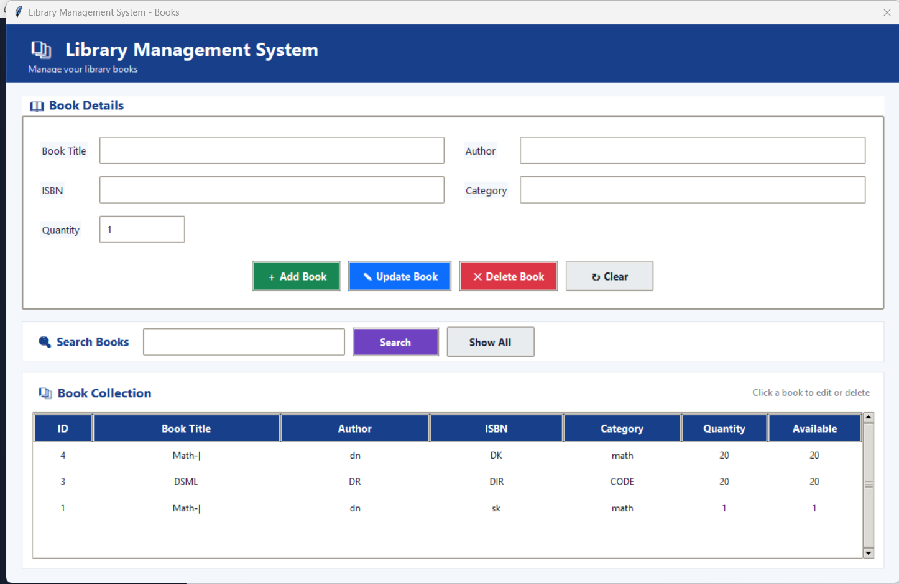
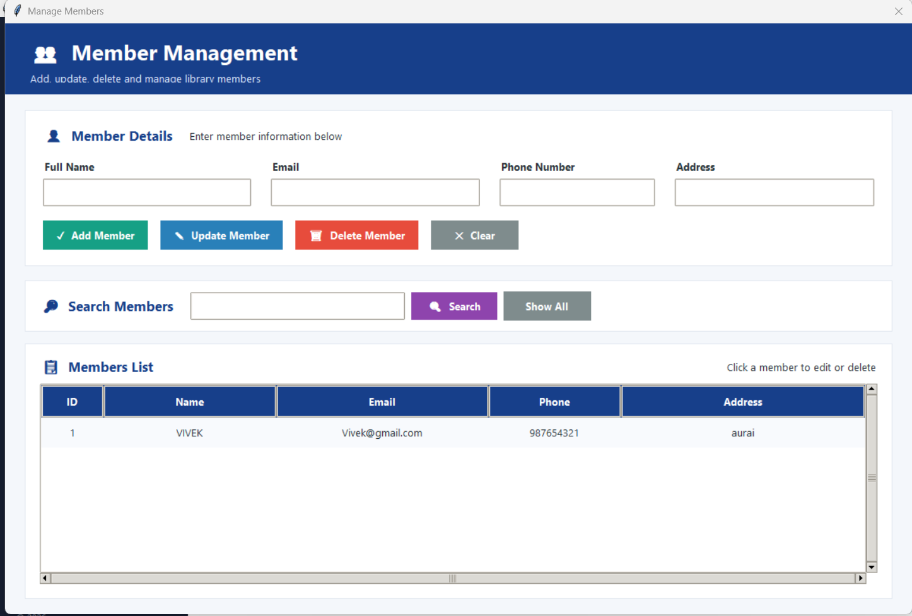
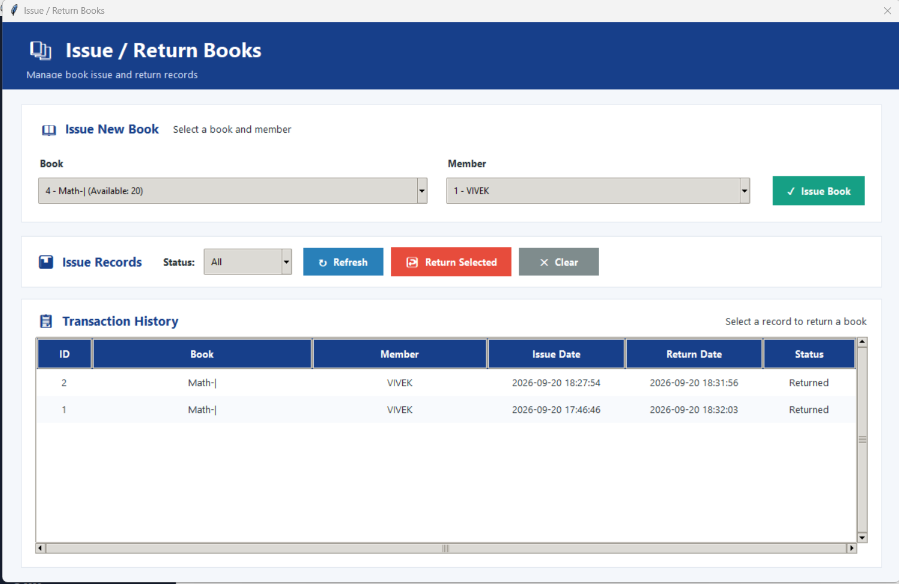

# 📚 Library Management System (LMS)

A simple and professional **Library Management System** developed using **Python and SQLite**.

This project helps manage books, library members, book issuing and returning through a user-friendly application.

---

## 📌 Project Overview

The **Library Management System (LMS)** is designed to simplify common library operations.

It provides features for:

- 🔐 Admin Login
- 📊 Dashboard
- 📚 Book Management
- 👥 Member Management
- 📖 Issue Book
- 🔄 Return Book
- 🗃️ SQLite Database
- 📋 Library Records Management

The project is suitable for **College Projects, Diploma Projects, B.Tech Projects and Python Practice**.
## 📸 Screenshots

### 🔐 Admin Login


### 📊 Dashboard


### 📚 Manage Books


### 👥 Manage Members


### 🔄 Issue / Return Book


---

## ✨ Features

### 🔐 Admin Login
- Secure admin login interface
- Admin authentication
- Access to library management features

### 📊 Dashboard
- Central dashboard for library management
- Quick access to different modules
- Easy navigation

### 📚 Manage Books
- Add new books
- View available books
- Update book information
- Delete book records
- Manage library book details

### 👥 Manage Members
- Add library members
- View member details
- Update member information
- Delete member records

### 📖 Issue Book
- Issue books to registered members
- Store issue information
- Maintain book issue records

### 🔄 Return Book
- Return issued books
- Update book availability
- Maintain return records

### 🗃️ SQLite Database
- Lightweight SQLite database
- Stores books, members and issue/return information
- No separate database server required

---

## 🛠️ Technologies Used

| Technology | Purpose |
|---|---|
| Python | Application Development |
| SQLite | Database Management |
| SQL | Database Operations |
| Git | Version Control |
| GitHub | Project Hosting |

---

## 💻 Requirements

Before running the project, make sure you have:

- Python 3.x
- VS Code / PyCharm / any Python IDE
- Git (optional, for GitHub)
- Windows / Linux / macOS

Check Python installation:
👨‍💻 Developer

Ashutosh Kumar

Computer Science Engineering Student

GitHub

AshutoshKumar950

⭐ Support

If you find this project useful:

⭐ Star the repository
🍴 Fork the repository
🛠️ Improve the project
📢 Share it with other students

🔑 Admin Password 


User ID admin  ----- ya Admin

Password - admin123

```bash
python --version
